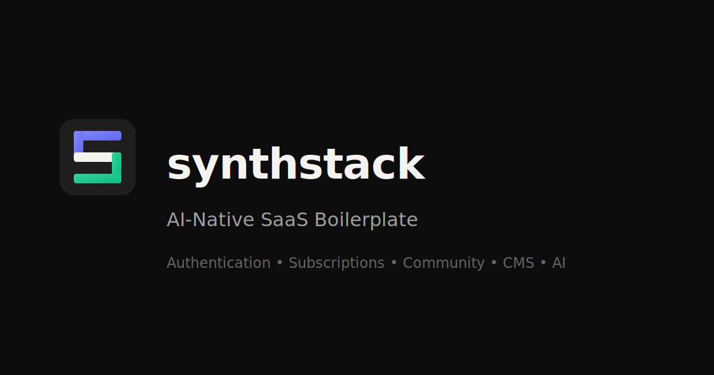

# SynthStack Community Edition

[](https://github.com/manicinc/synthstack/actions/workflows/ci.yml)    

**AI-Native SaaS Boilerplate**

Build your SaaS in days, not months. Cross-platform (web, iOS, Android, desktop, PWA) from a single codebase. Complete with authentication, payments, CMS, and AI copilot.



## ✨ Why SynthStack?

- **Ship Faster** - Everything wired up: auth, payments, database, email, analytics
- **AI-Ready** - Built-in AI copilot with streaming responses and credit system
- **Cross-Platform** - One codebase builds web, iOS, Android, desktop (Electron), and PWA
- **Easy to Rebrand** - Centralized `config.json` makes white-labeling simple
- **Production-Ready** - Docker Compose + Traefik for zero-downtime deployments

## 🚀 Quick Start

```bash
# Clone the repository
git clone https://github.com/manicinc/synthstack.git
cd synthstack

# Copy environment template
cp .env.example .env

# Start all services
pnpm install && docker compose up -d && pnpm dev:web
```

Open http://localhost:3050 - your SaaS is running!

## 🛠️ Tech Stack

| Layer | Technology |
|-------|------------|
| **Frontend** | Vue 3, Quasar 2, TypeScript, Pinia |
| **API Gateway** | Fastify, Node.js |
| **CMS/Admin** | Directus 11.x |
| **Database** | PostgreSQL + pgvector |
| **Cache** | Redis |
| **AI** | OpenAI, Anthropic, OpenRouter |
| **Payments** | Stripe |
| **Email** | Resend |

## 📦 What's Included

### Core Features
- ✅ **Authentication** - Supabase or local PostgreSQL with OAuth
- ✅ **Stripe Billing** - Subscriptions, one-time payments, free trials
- ✅ **AI Copilot** - Chat interface with streaming responses
- ✅ **Directus CMS** - Content management for blog, products, pages
- ✅ **Email System** - Transactional emails via Resend
- ✅ **Analytics** - GDPR-compliant with consent management
- ✅ **i18n** - Multi-language support (6 languages)

### Developer Experience
- ✅ **TypeScript** - Full type safety across the stack
- ✅ **Monorepo** - pnpm workspaces + Turborepo
- ✅ **Testing** - 800+ tests with Vitest
- ✅ **Docker** - Development and production compose files
- ✅ **CI/CD** - GitHub Actions workflows included

## 🎨 Rebranding

SynthStack is designed for easy white-labeling:

### Step 1: Edit `config.json`

```json
{
  "app": {
    "name": "YourApp",
    "tagline": "Your Tagline",
    "domain": "yourapp.com"
  }
}
```

### Step 2: Replace Logos

Update files in `apps/web/public/logo/`

### Step 3: Deploy

```bash
APP_DOMAIN=yourapp.com docker compose -f deploy/docker-compose.yml up -d
```

📖 See [docs/REBRANDING_GUIDE.md](docs/REBRANDING_GUIDE.md) for complete instructions.

## 🔐 Default Credentials

| Service | Email | Password |
|---------|-------|----------|
| Directus Admin | `admin@synthstack.app` | `SynthStack2024!` |
| Demo User | `demo@synthstack.app` | `DemoUser2024!` |

> ⚠️ **Change all credentials in production!** See `.env.example`.

## 📁 Project Structure

```
synthstack/
├── apps/
│   └── web/                    # Vue 3 + Quasar frontend
├── packages/
│   ├── api-gateway/            # Fastify API Gateway
│   ├── ml-service/             # FastAPI ML service (optional)
│   ├── ts-ml-service/          # NestJS ML service (TypeScript)
│   └── types/                  # Shared TypeScript types
├── services/
│   └── directus/               # Directus CMS config
├── docs/                       # Documentation
├── config.json                 # Centralized branding config
├── docker-compose.yml          # Development environment
└── deploy/
    └── docker-compose.yml      # Production deployment
```

## 🔗 Service URLs (Development)

| Service | URL |
|---------|-----|
| Frontend | http://localhost:3050 |
| API Gateway | http://localhost:3003 |
| API Docs | http://localhost:3003/docs |
| Directus CMS | http://localhost:8099/admin |

## 📖 Documentation

| Guide | Description |
|-------|-------------|
| [Quick Start](docs/QUICK_START.md) | Get up and running |
| [Authentication](docs/AUTHENTICATION.md) | Auth setup & providers |
| [Deployment](docs/DEPLOYMENT_GUIDE.md) | Deploy to production |
| [Rebranding](docs/REBRANDING_GUIDE.md) | White-label customization |
| [Self-Hosting](docs/SELF_HOSTING.md) | Host on your own server |

## 🧪 Testing

```bash
# Run all tests
pnpm test

# Run with coverage
pnpm test:coverage

# Lint
pnpm lint

# Type check
pnpm typecheck
```

## 🚀 Deployment

### One-Command Deploy

```bash
# Set your domain and deploy
export APP_DOMAIN=yourapp.com
docker compose -f deploy/docker-compose.yml up -d
```

### Supported Providers

Works with any VPS provider:
- DigitalOcean
- Linode
- Vultr
- Hetzner
- AWS EC2
- Google Cloud

See [docs/DEPLOYMENT_PROVIDERS.md](docs/DEPLOYMENT_PROVIDERS.md) for provider-specific guides.

## 📄 License

MIT License - see [LICENSE](LICENSE) for details.

### What You Can Build

- ✅ Any SaaS product (CRM, invoicing, AI tools, etc.)
- ✅ Client projects
- ✅ Revenue-generating applications
- ❌ Competing SaaS boilerplate products

## 🤝 Contributing

1. Fork the repository
2. Create a feature branch (`git checkout -b feature/amazing`)
3. Commit changes (`git commit -m 'Add amazing feature'`)
4. Push to branch (`git push origin feature/amazing`)
5. Open a Pull Request

## 💬 Community

- [GitHub Discussions](https://github.com/manicinc/synthstack/discussions)
- [Discord](https://discord.gg/synthstack)
- [Twitter](https://twitter.com/synthstack)

---

Built with ❤️ by the SynthStack Team
