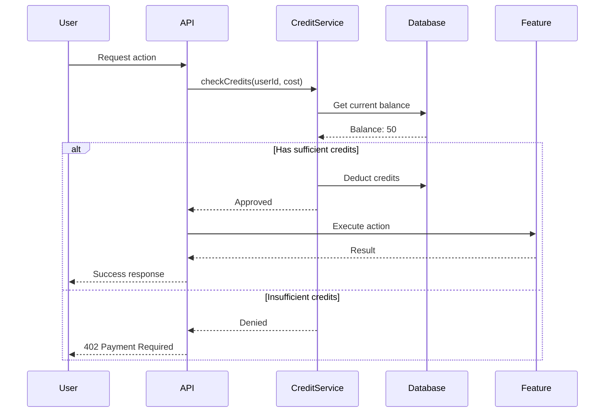

# Unified Credit System

SynthStack uses a unified credit system that powers all platform features including AI generations, Node-RED workflow executions, and referral rewards. This document explains how credits work across the platform.

## Table of Contents

1. [Overview](#overview)
2. [Credit Sources](#credit-sources)
3. [Credit Usage](#credit-usage)
4. [Pricing Tiers](#pricing-tiers)
5. [Rate Limiting](#rate-limiting)
6. [Referral Credits](#referral-credits)
7. [Technical Implementation](#technical-implementation)
8. [API Reference](#api-reference)

---

## Overview

Credits are the universal currency within SynthStack. They provide a consistent way to:

- **Measure usage** across different features
- **Allocate resources** based on subscription tier
- **Reward users** through referrals and promotions
- **Rate limit** to ensure fair usage

### Key Concepts

| Concept | Description |
|---------|-------------|
| **Credit Balance** | Total credits available to use |
| **Daily Allocation** | Credits refreshed each day based on tier |
| **Credit Cost** | Amount deducted per action |
| **Rate Limit** | Maximum actions per time period |

---

## Credit Sources

### 1. Subscription Allocation

Each subscription tier includes a daily credit allocation:

| Tier | Daily Credits | Monthly Equivalent |
|------|--------------|-------------------|
| Free | 10 | ~300 |
| Maker | 30 | ~900 |
| Pro | 100 | ~3,000 |
| Agency | Unlimited | Unlimited |

Credits reset daily at midnight UTC.

### 2. Referral Rewards

Earn credits through the referral program:

| Achievement | Credits Earned |
|-------------|---------------|
| Silver Tier (5 referrals) | 500 credits |
| Referral conversion bonus | Varies by season |

### 3. Promotional Credits

Occasionally awarded through:
- Welcome bonuses
- Seasonal promotions
- Beta testing participation
- Community contributions

### 4. Credit Purchases (Coming Soon)

One-time credit purchases for users who need more without upgrading tiers.

---

## Credit Usage

### AI Generations

AI-powered features consume credits based on complexity:

| Feature | Credit Cost | Notes |
|---------|-------------|-------|
| Chat message | 1 credit | Standard AI response |
| Long-form content | 2-5 credits | Based on output length |
| Code generation | 2 credits | Developer agent |
| Image analysis | 3 credits | Designer agent |
| Research query | 2 credits | Researcher agent |

### Node-RED Workflow Executions

Workflow executions are charged based on duration and complexity:

| Execution Type | Credit Cost Formula |
|----------------|-------------------|
| Simple flow (< 5 nodes) | 1 credit base |
| Medium flow (5-20 nodes) | 2 credits base |
| Complex flow (20+ nodes) | 3 credits base |
| Duration modifier | +1 credit per 30 seconds |

**Example Calculations:**

```
Simple flow, 10 seconds = 1 credit
Medium flow, 45 seconds = 2 + 1 = 3 credits
Complex flow, 2 minutes = 3 + 4 = 7 credits
```

### Other Features

| Feature | Credit Cost |
|---------|-------------|
| Document ingestion | 1 credit per document |
| Vector search query | 0.5 credits |
| GitHub PR creation | 2 credits |
| Email sending | 1 credit |

---

## Pricing Tiers

### Free Tier

**Price:** $0/month

- 10 credits/day
- 1 Node-RED flow
- 10 workflow executions/day
- Standard AI model (GPT-3.5)
- Community support

### Maker Tier

**Price:** $9.99/month or $99.90/year

- 30 credits/day
- 5 Node-RED flows
- 50 workflow executions/day
- Advanced AI model (GPT-4o)
- Email support
- Profile history

### Pro Tier

**Price:** $24.99/month or $249.90/year

- 100 credits/day
- 25 Node-RED flows
- 250 workflow executions/day
- All AI models
- Priority support
- Advanced analytics
- Team collaboration (3 seats)

### Agency Tier

**Price:** $49.99/month or $499.90/year

- Unlimited credits
- Unlimited Node-RED flows
- Unlimited workflow executions
- All AI models + fine-tuned
- Priority queue processing
- API access
- White-label options
- Team collaboration (10 seats)
- Dedicated support

---

## Rate Limiting

Beyond credit costs, rate limits prevent abuse:

### Per-Minute Limits

| Tier | AI Requests/min | Workflow Executions/min |
|------|-----------------|------------------------|
| Free | 5 | 2 |
| Maker | 15 | 10 |
| Pro | 30 | 25 |
| Agency | 60 | 50 |

### Concurrent Limits

| Tier | Concurrent AI Chats | Concurrent Workflows |
|------|--------------------|--------------------|
| Free | 1 | 1 |
| Maker | 3 | 3 |
| Pro | 5 | 10 |
| Agency | 10 | 25 |

### Rate Limit Response

When rate limited, the API returns:

```json
{
  "error": "Rate limit exceeded",
  "retryAfter": 30,
  "limit": 15,
  "remaining": 0,
  "resetAt": "2026-01-07T12:30:00Z"
}
```

---

## Referral Credits

The referral system integrates directly with the credit system:

### How It Works

1. **Earn rewards** by referring new users
2. **Unlock credit bonuses** at certain tiers
3. **Credits are added** directly to your balance
4. **No expiration** on referral-earned credits

### Referral Credit Rewards

| Tier | Referrals | Credit Reward |
|------|-----------|--------------|
| Silver | 5 | 500 credits |
| Custom | Varies | Season-dependent |

### Claiming Credits

When you claim a credit reward:

1. Go to your Referral Dashboard
2. Click "Claim" on the credit reward
3. Credits are instantly added to your balance
4. Transaction recorded in credit history

### Credit vs. Discount Rewards

| Reward Type | How It Works |
|-------------|--------------|
| **Credits** | Added to balance, use for any feature |
| **Discount Codes** | Percentage off purchases/subscriptions |
| **Free Months** | Subscription credit applied to billing |

---

## Technical Implementation

### Database Schema

**Credit Transactions Table:**

```sql
CREATE TABLE credit_transactions (
  id UUID PRIMARY KEY,
  user_id UUID NOT NULL REFERENCES users(id),
  organization_id UUID REFERENCES organizations(id),
  
  -- Transaction details
  amount INTEGER NOT NULL,  -- Positive = credit, Negative = debit
  balance_after INTEGER NOT NULL,
  
  -- Source/reason
  type VARCHAR(50) NOT NULL,  -- 'subscription', 'referral', 'usage', 'purchase'
  source VARCHAR(100),        -- 'ai_chat', 'workflow_execution', 'referral_silver'
  reference_id UUID,          -- Link to specific action
  
  -- Metadata
  metadata JSONB DEFAULT '{}',
  created_at TIMESTAMPTZ DEFAULT NOW()
);
```

**Daily Credit Allocation:**

```sql
CREATE TABLE credit_allocations (
  id UUID PRIMARY KEY,
  user_id UUID NOT NULL REFERENCES users(id),
  
  -- Daily tracking
  daily_limit INTEGER NOT NULL,
  daily_used INTEGER DEFAULT 0,
  last_reset_at TIMESTAMPTZ DEFAULT NOW(),
  
  -- Current balance (includes bonus credits)
  current_balance INTEGER DEFAULT 0,
  
  -- Tier info
  tier VARCHAR(50) NOT NULL,
  
  created_at TIMESTAMPTZ DEFAULT NOW(),
  updated_at TIMESTAMPTZ DEFAULT NOW()
);
```

### Credit Deduction Flow



### Node-RED Execution Credit Calculation

```typescript
function calculateWorkflowCreditCost(execution: WorkflowExecution): number {
  const nodeCount = execution.nodesExecuted;
  const durationMs = execution.duration;
  
  // Base cost by complexity
  let baseCost = 1;
  if (nodeCount > 20) baseCost = 3;
  else if (nodeCount > 5) baseCost = 2;
  
  // Duration modifier (1 credit per 30 seconds)
  const durationCost = Math.floor(durationMs / 30000);
  
  return baseCost + durationCost;
}
```

---

## API Reference

### Get Credit Balance

```http
GET /api/v1/credits/balance
Authorization: Bearer <token>
```

**Response:**

```json
{
  "success": true,
  "data": {
    "current_balance": 85,
    "daily_limit": 100,
    "daily_used": 15,
    "daily_remaining": 85,
    "next_reset": "2026-01-08T00:00:00Z",
    "tier": "pro"
  }
}
```

### Get Credit History

```http
GET /api/v1/credits/history?limit=50&type=usage
Authorization: Bearer <token>
```

**Response:**

```json
{
  "success": true,
  "data": {
    "transactions": [
      {
        "id": "uuid",
        "amount": -2,
        "balance_after": 85,
        "type": "usage",
        "source": "workflow_execution",
        "metadata": {
          "flow_id": "flow-123",
          "flow_name": "Lead Notification",
          "duration_ms": 1500,
          "nodes_executed": 8
        },
        "created_at": "2026-01-07T10:30:00Z"
      }
    ],
    "pagination": {
      "total": 150,
      "page": 1,
      "limit": 50
    }
  }
}
```

### Check Credit Availability

```http
POST /api/v1/credits/check
Authorization: Bearer <token>
Content-Type: application/json

{
  "action": "workflow_execution",
  "estimated_cost": 3
}
```

**Response:**

```json
{
  "success": true,
  "data": {
    "can_proceed": true,
    "current_balance": 85,
    "estimated_cost": 3,
    "balance_after": 82
  }
}
```

### Deduct Credits

```http
POST /api/v1/credits/deduct
Authorization: Bearer <token>
Content-Type: application/json

{
  "amount": 2,
  "source": "ai_chat",
  "reference_id": "message-uuid",
  "metadata": {
    "agent": "researcher",
    "tokens_used": 1500
  }
}
```

**Response:**

```json
{
  "success": true,
  "data": {
    "transaction_id": "uuid",
    "amount_deducted": 2,
    "new_balance": 83
  }
}
```

---

## Best Practices

### For Users

1. **Monitor your usage** - Check the dashboard regularly
2. **Optimize workflows** - Fewer nodes = lower costs
3. **Use referrals** - Earn bonus credits by sharing
4. **Choose the right tier** - Upgrade if consistently hitting limits

### For Developers

1. **Always check credits** before expensive operations
2. **Handle 402 errors** gracefully with upgrade prompts
3. **Log credit usage** for debugging and analytics
4. **Batch operations** when possible to reduce overhead

---

## Related Documentation

- [Referral System](./REFERRAL_SYSTEM.md) - Earn credits through referrals
- [Referral Getting Started](./guides/REFERRAL_GETTING_STARTED.md) - User guide
- [Pricing & Features](./PRICING_AND_FEATURES.md) - Tier comparison
- [Node-RED Integration](./LANGGRAPH_NODERED_ARCHITECTURE.md) - Workflow system

---

*Credits make SynthStack accessible while ensuring sustainable operations.*


